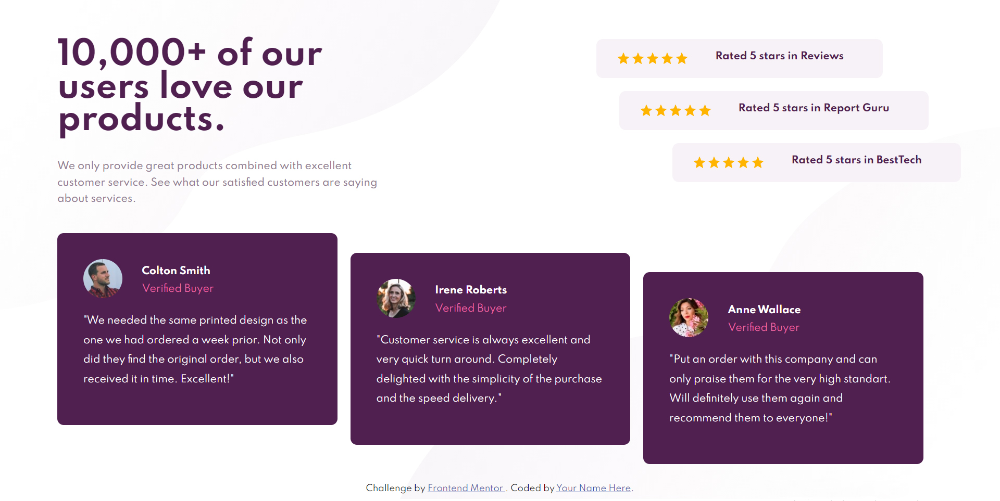

# Frontend Mentor - Social proof section solution

This is a solution to the [Social proof section challenge on Frontend Mentor](https://www.frontendmentor.io/challenges/social-proof-section-6e0qTv_bA). Frontend Mentor challenges help you improve your coding skills by building realistic projects. 

## Table of contents

- [Overview](#overview)
  - [The challenge](#the-challenge)
  - [Screenshot](#screenshot)
  - [Links](#links)
- [My process](#my-process)
  - [Built with](#built-with)
  - [What I learned](#what-i-learned)
  - [Useful resources](#useful-resources)
- [Author](#author)

## Overview

### The challenge

Users should be able to:

- View the optimal layout for the section depending on their device's screen size

### Screenshot

### Links

- Solution URL: (https://www.frontendmentor.io/solutions/social-proof-section-with-reactjs-and-materialui-WAkjZvBKp)
- Live Site URL: (https://ozge-demiryol.github.io/social-proof-section-master/)

## My process

### Built with

- Semantic HTML5 markup
- CSS custom properties
- [React](https://reactjs.org/) - JS library
- [Material-UI](https://material-ui.com) - For 5 star component

### Useful resources

- [Material-UI rating component](https://material-ui.com/components/rating/) - I got rating component from Material-UI.
- [W3 Schools](https://www.w3schools.com/) - This is one of sources I use frequently for CSS properties.
- [Deploying a React app in GitHub Pages](https://dev.to/yuribenjamin/how-to-deploy-react-app-in-github-pages-2a1f) I deploy my React apps by following these instructions. I highly reccomend this source for React apps, it's pretty helpful.

## Author

- Website - [Özge Demiryol](https://github.com/ozge-demiryol)

